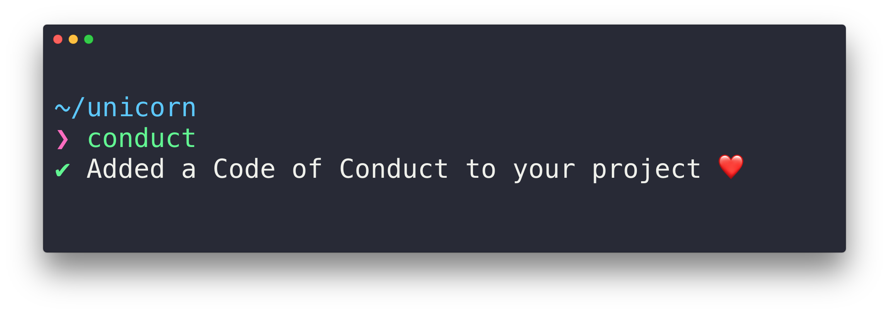

# conduct

> Generate a Code of Conduct for your project - Provided by [Contributor Covenant](https://contributor-covenant.org)



## Why have a Code of Conduct?

tl;dr Having a Code of Conduct is helpful in fostering and enforcing a friendly inclusive community.

> Open source projects suffer from a startling lack of diversity, with dramatically low representation by women, people of color, and other marginalized populations. Part of this problem lies with the very structure of some projects: the use of insensitive language, thoughtless use of pronouns, assumptions of gender, and even sexualized or culturally insensitive names.

> An easy way to begin addressing this problem is to be overt in our openness, welcoming all people to contribute, and pledging in return to value them as human beings and to foster an atmosphere of kindness, cooperation, and understanding.

> A Code of Conduct can be one way to express these values.

> Do not simply add the Contributor Covenant to your project and assume that any problems with civility, harassment, or discrimination will be solved.

> — https://contributor-covenant.org

## Install

```
$ npm install --global conduct
```

## Usage

```
$ conduct --help

  Usage
    $ conduct

  Example
    $ conduct --language=de

  Options
    --uppercase, -c   Use uppercase characters (e.g. CODE-OF-CONDUCT.md)
    --underscore, -u  Use underscores instead of dashes (e.g. code_of_conduct.md)
    --language, -l    The language of the Code of Conduct [Default: en]
    --directory, -d   The output directory [Default: .]
```

You can also use this to update an existing Code of Conduct.

If a readme file exists in the directory, the case for the generated Code of Conduct file will match.\
(e.g. `readme.md` produces ` code-of-conduct.md`, `README.md` produces `CODE-OF-CONDUCT.md`).

### Options

#### email

When generating a new Code of Conduct it will try to infer your email to use as contact email. If it can't, it will prompt for it. The email is persisted and only asked once. You can force update the email with `conduct --email=your@email.com`. When updating an existing Code of Conduct, it will use the existing contact email unless you pass the `--email` flag.

#### language

The language of the Code of Conduct can be set with `conduct --language=en`. The language is persisted and can be updated by passing the `--language` flag at any time. See the [vendor](/vendor) folder for all available languages. The default is '`en`' for English.

## Code of Conduct

[Contributor Code of Conduct](code-of-conduct.md). By participating in this project you agree to abide by its terms.
